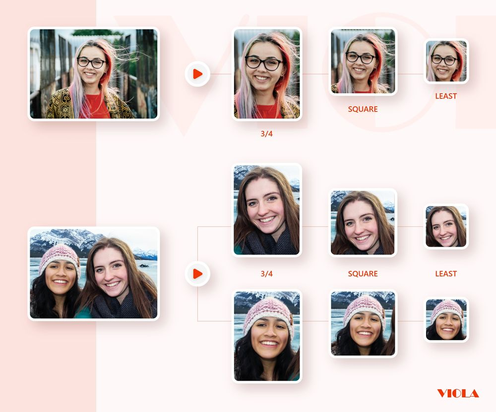

# Viola
[  ](https://bintray.com/darwinfrancis/Viola/com.darwin.viola.still/_latestVersion)
[](http://developer.android.com/index.html)
[](https://android-arsenal.com/api?level=15)
[](https://github.com/darwinfrancis/face-perception/blob/master/LICENSE.txt)


With Viola android face detection library, you can detect faces in a bitmap, crop faces using predefined algorithm and get additional information from the detected faces.



## Getting Started
**Demo application**

Download sample application [sample_v_1.1.1](app-voila-sample.apk)

**Compatibility**
 * *Minimum Android SDK* : Viola 1.1.1 requires a minimum API level of 21.

**Installation**

Download the latest aar from [JCenter](https://bintray.com/darwinfrancis/Viola/download_file?file_path=com%2Fdarwin%2Fviola%2Fstill%2F1.1.1%2Fstill-1.1.1.aar) or grab via

Gradle:
```gradle
dependencies {
  implementation 'com.darwin.viola:still:1.1.1'
}
```

or Maven:

```xml
<dependency>
  <groupId>com.darwin.viola</groupId>
  <artifactId>still</artifactId>
  <version>1.1.1</version>
  <type>pom</type>
</dependency>
```


## Usage
**Kotlin**
```kotlin
val viola = Viola(listener)
viola.detectFace(bitmap)

private val listener: FaceDetectionListener = object : FaceDetectionListener {

        override fun onFaceDetected(result: Result) {}

        override fun onFaceDetectionFailed(error: FaceDetectionError, message: String) {}
}
```
*with FaceOptions*
```kotlin
val faceOption =
    FaceOptions.Builder()
               .enableProminentFaceDetection()
               .enableDebug()
               .build()
viola.detectFace(bitmap,faceOption)
```


**Java**
```java
Viola viola = new Viola(listener);
viola.detectFace(bitmap);

private final FaceDetectionListener listener = new FaceDetectionListener() {
        @Override
        public void onFaceDetected(@NotNull Result result) { }

        @Override
        public void onFaceDetectionFailed(@NotNull FaceDetectionError error, @NotNull String message) { }
};
```
*with FaceOptions*
```java
FaceOptions faceOptions = new FaceOptions.Builder()
                .enableProminentFaceDetection()
                .enableDebug()
                .build();
viola.detectFace(bitmap,faceOptions);
```

### Configure the face detector
Viola is currently extended with the following configurations. Instructions on how to use them in your own application are linked below.

| FaceOptions | Description | Type | Default |
| :--- | :--- | :--- | :--- |
| `prominentFaceDetection` |  Indicates whether to detect all faces, or to only detect the most prominent face | boolean | false |
| `cropAlgorithm` |  Extended option for controlling crop constraints | CropAlgorithm | CropAlgorithm.THREE_BY_FOUR |
| `minFaceSize` |  The minimum size percentage, relative to the image, of faces to detect | int | 15 |
| `debug` |  enables debug log | boolean | false |

> CropAlgorithm.THREE_BY_FOUR : Performs face crop in three by four ratio

> CropAlgorithm.SQUARE        : Performs face crop in 1:1 ratio(useful when showing face in circular view)

> CropAlgorithm.LEAST         : Performs face crop with minimum padding(possibly reduce face overlap on multi face detection)

### Face detection result
Viola provides the following values in Result class

| Result | Description | Type |
| :--- | :--- | :--- |
| `faceCount` |  The number of faces croped | int |
| `facePortraits` |  Contains list of cropped faces | FacePortrait |
| `face` |  The cropped face bitmap  | Bitmap |
| `smileProbability` |  Giving a probability that the face is smiling  | Float |
| `leftEyeOpenProbability` |  Giving a probability that the face's left eye is open  | Float |
| `rightEyeOpenProbability` |  Giving a probability that the face's right eye is open  | Float |
| `pixelBetweenEyes` |  The number of pixels between the eyes  | Double |
| `faceSizePercentage` |  The size of face relative to the input image  | Float |
| `facePose` |  Provides rotation of face in X,Y,Z plane  | FacePose |

## Author
Darwin Francis - @darwinfrancis on GitHub, @darwin-francis on linkedin

## Roadmap
-Add gender classification available as plugin
-Implement face detection and cropping from live camera preview.

## Contributing
Pull requests are welcome. For major changes, please open an issue first to discuss what you would like to change.

License
-------

    MIT License

    Copyright (c) 2020 Darwin Francis

    Permission is hereby granted, free of charge, to any person obtaining a copy
    of this software and associated documentation files (the "Software"), to deal
    in the Software without restriction, including without limitation the rights
    to use, copy, modify, merge, publish, distribute, sublicense, and/or sell
    copies of the Software, and to permit persons to whom the Software is
    furnished to do so, subject to the following conditions:

    The above copyright notice and this permission notice shall be included in all
    copies or substantial portions of the Software.
    
    THE SOFTWARE IS PROVIDED "AS IS", WITHOUT WARRANTY OF ANY KIND, EXPRESS OR
    IMPLIED, INCLUDING BUT NOT LIMITED TO THE WARRANTIES OF MERCHANTABILITY,
    FITNESS FOR A PARTICULAR PURPOSE AND NONINFRINGEMENT. IN NO EVENT SHALL THE
    AUTHORS OR COPYRIGHT HOLDERS BE LIABLE FOR ANY CLAIM, DAMAGES OR OTHER
    LIABILITY, WHETHER IN AN ACTION OF CONTRACT, TORT OR OTHERWISE, ARISING FROM,
    OUT OF OR IN CONNECTION WITH THE SOFTWARE OR THE USE OR OTHER DEALINGS IN THE
    SOFTWARE.
    
    
    
